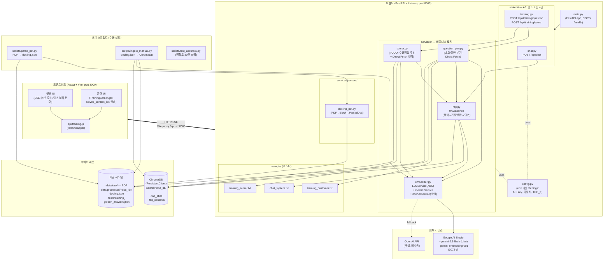
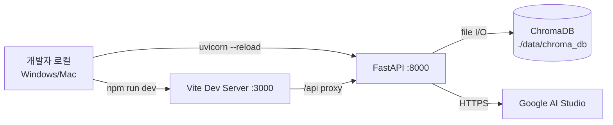
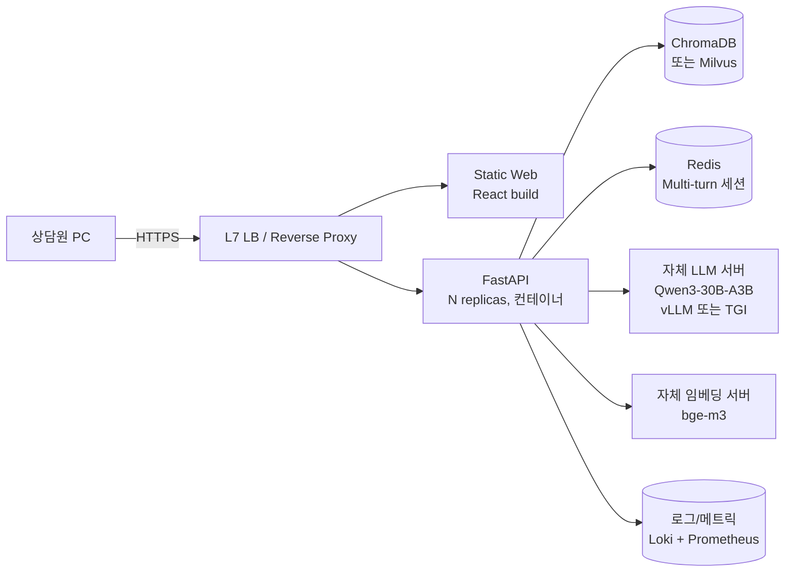

# 시스템 구성도

> 증권 상담원 AI 코치 PoC — 컴포넌트 구조 및 배포 토폴로지
>
> Last Updated: 2026-05-08

---

## 1. 개요

본 시스템은 두 가지 모드를 단일 서비스로 제공한다.

| 모드     | 사용자        | 흐름                                                                   |
| -------- | ------------- | ---------------------------------------------------------------------- |
| 챗봇     | 상담원        | 질문 입력 → RAG 검색 → LLM 답변 + 출처 표시 (SSE 스트리밍)             |
| 훈련     | 신입 상담원   | 카테고리/난이도 선택 → AI 출제 → 답변 입력 → AI 채점 + 피드백          |

핵심 설계 원칙은 [README.md](../README.md)와 [docs/api-spec.md](./api-spec.md) 참조.

---

## 2. 논리 아키텍처 (계층 뷰)

---

## 3. 컴포넌트 책임 매트릭스

| 컴포넌트                   | 경로                                  | 책임                                                                  | 소유자        |
| -------------------------- | ------------------------------------- | --------------------------------------------------------------------- | ------------- |
| FastAPI 엔트리포인트       | `backend/main.py`                     | 라우터 등록, CORS, 헬스체크                                            | 공통          |
| 설정                       | `backend/config.py`                   | env 로드, 모델명/가중치/TOP_K 노출                                     | 공통          |
| 챗봇 라우터                | `backend/routers/chat.py`             | `/api/chat` request/response 모델, SSE                                 | 우치          |
| 훈련 라우터                | `backend/routers/training.py`         | `/api/training/{question,score}` 라우팅                                | 승구리        |
| RAG 서비스                 | `backend/services/rag.py`             | 임베딩 → titles/contents 검색 → Max Pooling → 가중 병합 → top_k        | 우치          |
| 질문 생성 서비스           | `backend/services/question_gen.py`    | 데모/일반 모드 분기, Direct Fetch, 고객 질문 LLM 생성                  | 승구리        |
| 채점 서비스                | `backend/services/scorer.py`          | (구현 예정) 수동 정답 우선, 없으면 Direct Fetch + LLM 채점             | 승구리        |
| LLM 추상화                 | `backend/services/embedder.py`        | `LLMService(ABC)` + Gemini/OpenAI 구현체                                | 공통          |
| PDF 파서                   | `backend/services/parsers/docling_pdf.py` | Docling으로 PDF → `ParsedDocument`(Block 리스트)                  | 승구리        |
| 공통 문서 모델             | `backend/models/parsed_document.py`   | `Block`, `ParsedDocument` Pydantic 스키마                              | 공통          |
| 프롬프트                   | `backend/prompts/*.txt`               | system 프롬프트 (버전 관리, 별도 커밋)                                 | 공통(상호리뷰) |
| 인제스트 스크립트          | `scripts/ingest_manual.py`            | docling.json → 청킹 → 임베딩 → ChromaDB upsert                         | 승구리        |
| 정확도 회귀 테스트         | `scripts/test_accuracy.py`            | 30건 테스트셋 정확도 측정                                              | 우치          |
| 프론트엔드 — 훈련 UI       | `frontend/src/components/training/`   | TrainingScreen, 출제/답변 입력 UI                                       | 승구리        |
| 프론트엔드 — API 클라이언트| `frontend/src/api/training.js`        | fetch wrapper                                                          | 승구리        |

---

## 4. 배포 토폴로지

### 4.1 PoC (현재)

- **단일 머신**에서 프론트(Vite)와 백엔드(Uvicorn)를 별도 프로세스로 실행
- ChromaDB는 파일 기반 PersistentClient로 백엔드 프로세스에 임베드
- 외부 의존성은 Google AI Studio HTTPS 한 곳

### 4.2 실도입 후보 (폐쇄망)

- 폐쇄망 요구사항으로 외부 API 의존을 제거(Qwen3, bge-m3 자체 호스팅)
- 임베딩 차원이 바뀌면 ChromaDB 컬렉션 전체 재인제스트 필요 (ADR-0008 참조)
- Multi-turn 도입 시 Redis 세션 스토어 추가 (실도입 TODO T1)

---

## 5. 외부 인터페이스

| 인터페이스             | 프로토콜      | 방향          | 비고                                                                |
| ---------------------- | ------------- | ------------- | ------------------------------------------------------------------- |
| 클라이언트 ↔ 백엔드    | HTTP / SSE    | 양방향        | `/api/*`, SSE는 `/api/chat`에서 `event: sources/token/done`         |
| 백엔드 ↔ Google AI     | HTTPS (REST)  | outbound      | `google-genai` SDK, `asyncio.to_thread` 래핑                        |
| 백엔드 ↔ ChromaDB      | 파일 I/O      | 양방향        | PersistentClient, 별도 데몬 없음                                    |
| 배치 ↔ 파일 시스템     | 파일 I/O      | read/write    | `data/raw/` (PDF), `data/processed/{doc_id}/docling.json`           |

---

## 6. 보안/운영 고려사항 (PoC 한정)

- **API 키**: `.env`에서 로드, 코드/Git 미포함 (`.gitignore`에 `.env`)
- **고객사 원본 데이터**: `data/raw/`, `data/chroma_db/`는 `.gitignore` (RULES.md 금지사항 #2)
- **CORS**: `http://localhost:3000` 허용 — 실도입 시 도메인 화이트리스트 재정의
- **로깅**: `backend/utils/logger.py`(현재 TODO) — 개인정보 마스킹 규칙 도입 예정
- **인증/인가**: PoC는 미적용. 실도입 시 SSO/사내 IdP 연동 필요

---

## 7. 관련 문서

- [docs/api-spec.md](./api-spec.md) — API/스키마 single source of truth
- [docs/api-spec-formal.md](./api-spec-formal.md) — 정형화된 API 명세
- [docs/data-flow.md](./data-flow.md) — 시퀀스/DFD
- [docs/db-design.md](./db-design.md) — ChromaDB/파일 스토리지 설계
- [docs/adr/](./adr/) — 설계 결정 기록
