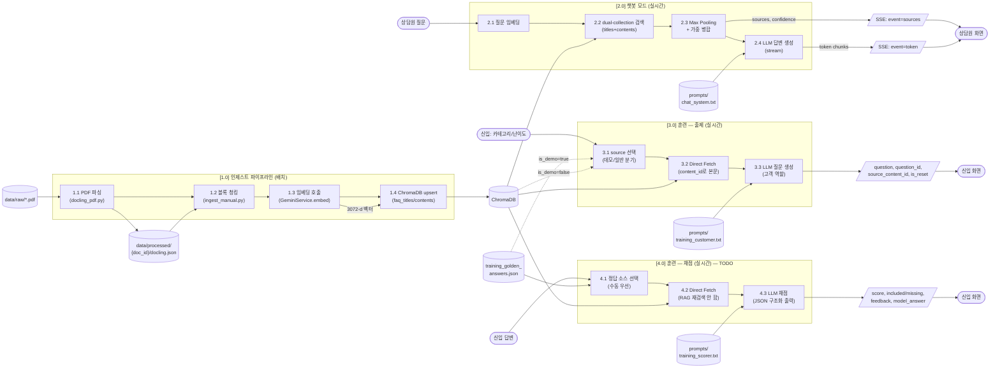
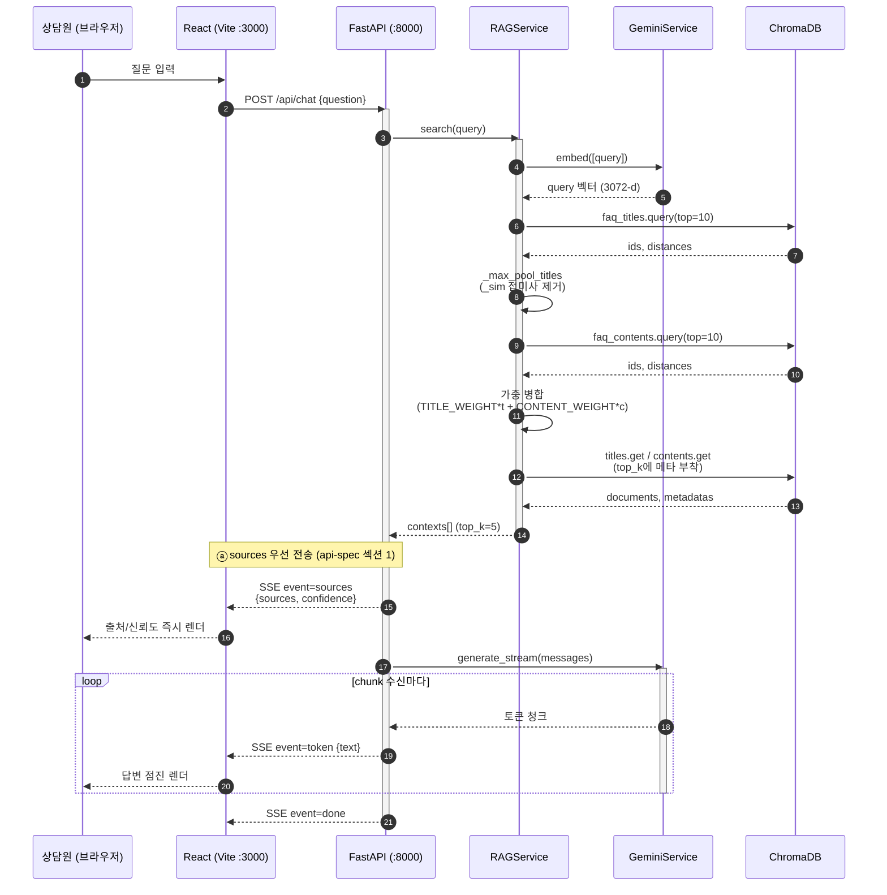
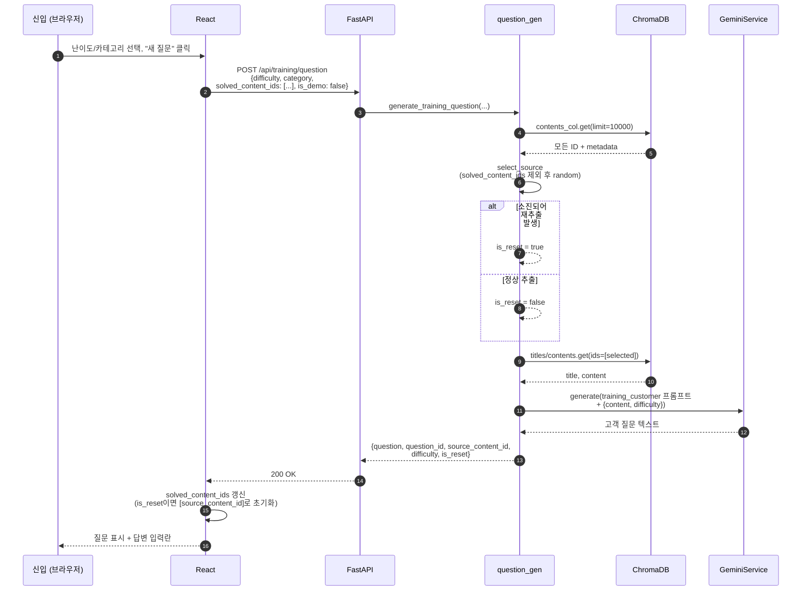
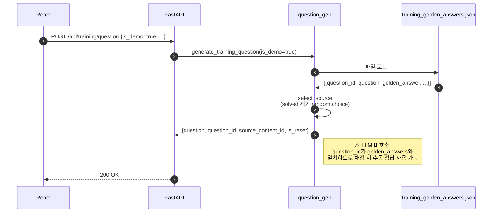
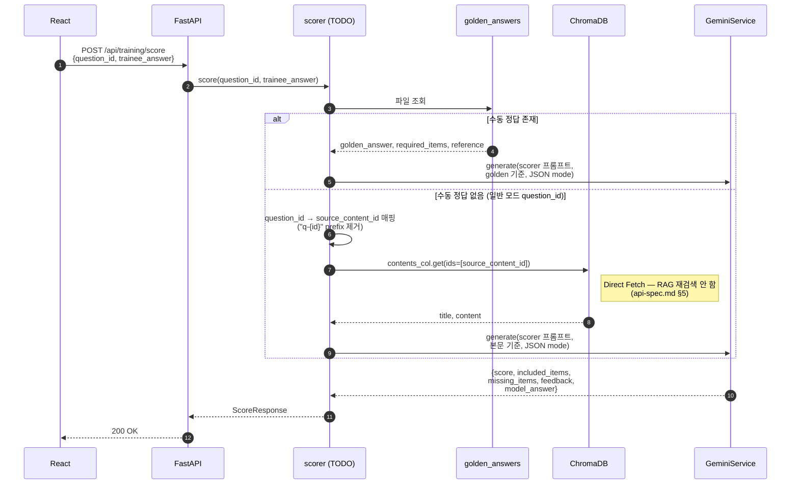
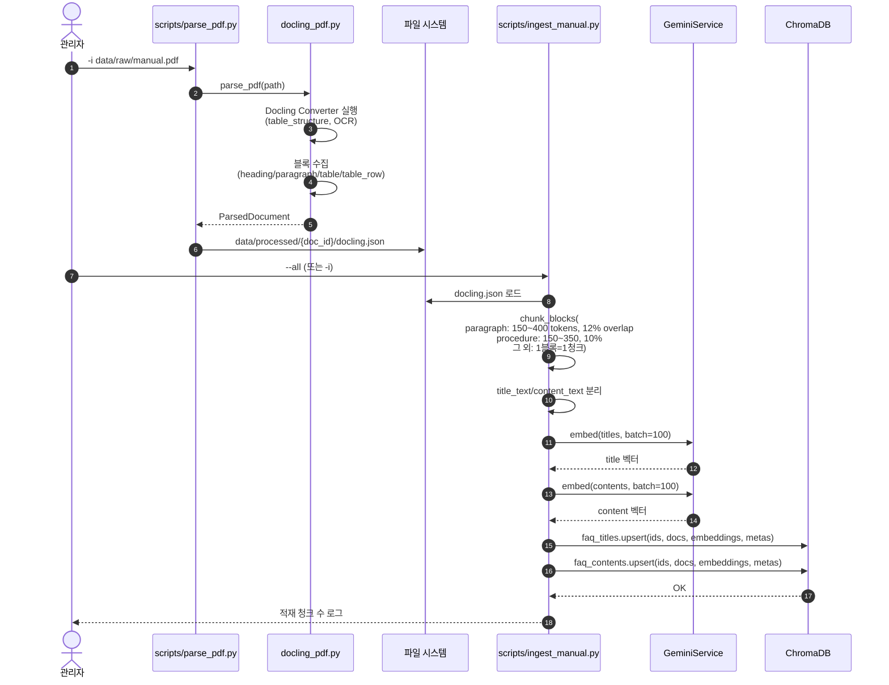

# 데이터 흐름도

> 증권 상담원 AI 코치 PoC — DFD 및 주요 시나리오 시퀀스
>
> Last Updated: 2026-05-08

---

## 1. 데이터 흐름 개요 (Level 0 — Context Diagram)

```mermaid
flowchart LR
  Operator([상담원])
  Trainee([신입 상담원])
  Admin([관리자])
  System(((증권 상담원<br/>AI 코치)))
  Manuals[(업무편람 PDF)]
  Goldens[(수동 정답<br/>golden answers)]
  LLM([Google AI Studio])

  Operator -->|질문| System
  System -->|답변+출처| Operator

  Trainee -->|난이도/카테고리,<br/>답변 입력| System
  System -->|고객 질문,<br/>채점 결과| Trainee

  Admin -->|편람 PDF 업로드| Manuals
  Admin -->|정답 작성| Goldens
  Manuals -->|인제스트 (배치)| System
  Goldens -->|로딩| System

  System <-->|임베딩/생성<br/>HTTPS| LLM
```

---

## 2. Level 1 — 주요 데이터 처리 단위 (DFD)



> 4.0 채점 흐름은 `services/scorer.py`가 현재 TODO 상태이며, [docs/api-spec.md 섹션 5](./api-spec.md) 명세 기준으로 구현될 예정.

---

## 3. 주요 시퀀스 다이어그램

### 3.1 챗봇 모드 — 단일 질문 처리 (SSE 스트리밍)



**성능 목표:** 첫 토큰 1초 이내, 전체 5초 이내 (api-spec.md §1).

---

### 3.2 훈련 모드 — 일반 출제 (LLM 즉석 생성)



---

### 3.3 훈련 모드 — 데모 출제 (수동 정답 사전 매칭)



---

### 3.4 훈련 모드 — 채점 (TODO 명세 기준)



---

### 3.5 인제스트 파이프라인 (배치)



---

## 4. 데이터 객체 흐름표

| # | 객체              | 생성 위치                          | 형식                              | 소비처                              |
| - | ----------------- | ---------------------------------- | --------------------------------- | ----------------------------------- |
| 1 | PDF 원본          | `data/raw/`                        | PDF                               | `parse_pdf.py`                      |
| 2 | `ParsedDocument`  | `docling_pdf.py`                   | Pydantic / JSON                   | `ingest_manual.py`                  |
| 3 | docling.json      | `data/processed/{doc_id}/`         | JSON                              | `ingest_manual.py`                  |
| 4 | Chunk             | `ingest_manual.chunk_blocks`       | dict (title_text, content_text)   | embedder, ChromaDB                  |
| 5 | 임베딩 벡터        | `GeminiService.embed`              | `list[float]` (3072-d)            | ChromaDB upsert/query               |
| 6 | RAG contexts       | `RAGService.search`                | `list[{id, title, content, score, source_*}]` | LLM 프롬프트 빌더, 응답 sources |
| 7 | SSE 이벤트         | `routers/chat.py`(예정)            | `event: sources/token/done`       | 프론트 렌더링                        |
| 8 | golden_answer      | `tests/training_golden_answers.json` | JSON                              | `question_gen`(데모), `scorer`     |
| 9 | ScoreResponse      | `scorer.py`(TODO)                  | JSON                              | 프론트                                |

---

## 5. 흐름상 주의 사항

| 흐름             | 주의                                                                                       |
| ---------------- | ------------------------------------------------------------------------------------------ |
| RAG 점수 계산    | **Max Pooling 후 가중 병합** 순서 엄수 (api-spec.md §3, ADR-0003)                          |
| SSE              | sources를 **첫 이벤트로** 전송. 답변 토큰보다 먼저 (ADR-0004)                              |
| 출제→채점 연계   | 출제 시점 `source_content_id`로 채점 시 Direct Fetch. **RAG 재검색 금지** (ADR-0005)        |
| 데모/일반 분기   | `is_demo=true`이면 LLM 미호출. `question_id`가 골든답과 매칭 가능해야 함 (ADR-0007)         |
| solved 상태       | 서버는 Stateless. 프론트가 `solved_content_ids` 보유, `is_reset=true`이면 클라이언트 초기화 (ADR-0006) |
| 임베딩 차원       | 모델 교체 시 ChromaDB 전체 재인제스트 필요 (3072-d ↔ 1536-d 등) (ADR-0008)                |

---

## 6. 관련 문서

- [docs/architecture.md](./architecture.md) — 컴포넌트 구조
- [docs/api-spec.md](./api-spec.md) — API/스키마 single source of truth
- [docs/api-spec-formal.md](./api-spec-formal.md) — 정형화된 API 명세
- [docs/db-design.md](./db-design.md) — 스토리지 설계
- [docs/adr/](./adr/) — 설계 결정 기록
