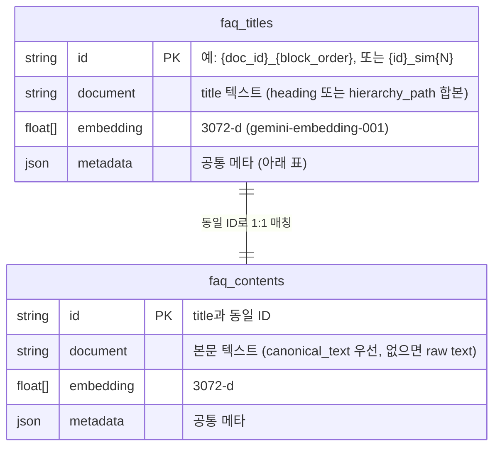

# DB 설계서

> 증권 상담원 AI 코치 — 스토리지 (벡터DB + 파일 시스템) 설계
>
> Last Updated: 2026-05-08

---

## 1. 데이터 저장소 전체 구조

본 PoC는 **전통적인 RDBMS를 사용하지 않는다**. 데이터 모델은 다음 3계층으로 구성된다.

| 계층            | 저장소                | 역할                                                              | Git 포함 여부      |
| --------------- | --------------------- | ----------------------------------------------------------------- | ------------------ |
| 원본 (Raw)      | 파일 시스템           | 업무편람 PDF, FAQ JSON 원본                                       | ❌ (`.gitignore`)  |
| 가공 (Processed)| 파일 시스템           | docling 파싱 결과 JSON, 골든답 JSON                                | 부분(golden만 ✓)   |
| 검색 인덱스     | ChromaDB (PersistentClient) | 임베딩 벡터 + 메타데이터 (RAG 검색용)                       | ❌                 |

```
┌─────────────────────────────────────────────────────────────┐
│  data/                                                       │
│  ├── raw/                  ← 고객사 원본 (Git 미포함)         │
│  │   └── *.pdf                                                │
│  ├── processed/            ← 파싱 산출물 (Git 미포함)         │
│  │   └── {doc_id}/                                            │
│  │       └── docling.json                                     │
│  └── chroma_db/            ← 벡터 인덱스 (Git 미포함)         │
│      ├── chroma.sqlite3                                       │
│      └── {hnsw_uuid}/                                          │
├──────────────────────────────────────────────────────────────┤
│  tests/                                                       │
│  ├── training_golden_answers.json   ← Git 포함 (정답 관리)    │
│  └── test_questions.json            ← 정확도 회귀 테스트셋    │
└──────────────────────────────────────────────────────────────┘
```

---

## 2. ChromaDB 설계

### 2.1 클라이언트/엔진

| 항목         | 값                                                      |
| ------------ | ------------------------------------------------------- |
| 클라이언트    | `chromadb.PersistentClient(path=settings.CHROMA_DB_PATH)` |
| 기본 경로    | `./data/chroma_db` (env `CHROMA_DB_PATH`로 override 가능) |
| 인덱스 엔진  | HNSW (`hnsw:space: cosine`)                             |
| 라이브러리   | `chromadb >= 0.5.0, < 1.0.0`                            |

### 2.2 컬렉션 ER 모델

ChromaDB는 스키마리스이므로 ER 다이어그램은 "동일 ID로 연결된 두 컬렉션" 개념도로 표현한다.



### 2.3 컬렉션 정의

#### 2.3.1 `faq_titles`

| 항목         | 값                                                                                  |
| ------------ | ----------------------------------------------------------------------------------- |
| 목적         | 제목/소제목 임베딩 — 주제 매칭                                                       |
| ID           | `{doc_id}_{block_order}` (원본). 유사 제목은 `{id}_sim{N}` 접미사 (현재 미사용)       |
| Document     | heading 텍스트 또는 `hierarchy_path` 합본 (`" > "` join), fallback은 `content_text`  |
| Embedding    | Gemini `gemini-embedding-001` (3072-d)                                              |
| Metric       | cosine                                                                              |

#### 2.3.2 `faq_contents`

| 항목         | 값                                                                                  |
| ------------ | ----------------------------------------------------------------------------------- |
| 목적         | 본문 임베딩 — 세부 매칭                                                              |
| ID           | titles와 **완전 동일**                                                                |
| Document     | `Block.canonical_text` 우선, 없으면 `Block.text`. 청크 병합 시 줄바꿈으로 결합        |
| Embedding    | 동일 (3072-d)                                                                       |
| Metric       | cosine                                                                              |

> ⚠️ ChromaDB **0.5.x** 기준 `metadata` 키에 list/dict 직접 저장 불가. `hierarchy_path`는 `json.dumps`로 문자열화하여 저장한다 (`ingest_manual.py:_build_metadata`).

### 2.4 메타데이터 스키마 (양 컬렉션 공통)

| 키                | 타입    | 예시                                       | 비고                                                    |
| ----------------- | ------- | ------------------------------------------ | ------------------------------------------------------- |
| `source_document` | string  | `account_manual.pdf`                       | 원본 PDF 파일명                                          |
| `source_page`     | string  | `p.23` 또는 ``                             | 페이지 표기, 페이지 정보 없으면 빈 문자열               |
| `category`        | string  | `계좌` 또는 ``                             | 현재 PoC는 빈 문자열 (인제스트에서 미설정)              |
| `doc_id`          | string  | `9b1c…`                                    | sha1[:16] of resolved path (`docling_pdf._doc_id_from_path`) |
| `block_type`      | string  | `paragraph` \| `heading` \| `table` \| `table_row` \| `rule` \| `procedure` \| `faq` \| `notice` | 청크 첫 블록 타입 |
| `hierarchy_path`  | string (JSON) | `"[\"계좌개설\",\"가. 신규개설\"]"`  | `Block.hierarchy_path`를 `json.dumps`. 없으면 `""`      |

### 2.5 인덱스/제약

- ChromaDB의 ANN 인덱스는 HNSW로 자동 구축됨. 별도 보조 인덱스 없음.
- `id` 유일성은 ChromaDB가 보장 (`upsert`로 중복 시 갱신).
- 같은 `id`로 `faq_titles`와 `faq_contents` 양쪽에 적재하여 1:1 매칭 보장 (`ingest_manual.ingest_document`).

### 2.6 데이터 흐름 — 적재 (Ingest)

```
data/raw/manual.pdf
   └─ scripts/parse_pdf.py
       └─ services/parsers/docling_pdf.parse_pdf
           ├─ Docling Converter 실행
           ├─ Block 수집 (heading/paragraph/table/table_row)
           ├─ 한국어 개조식 패턴으로 heading_level 추정
           ├─ heading stack → hierarchy_path 부착
           ├─ table → 마크다운 + 행단위 canonical_text
           └─ data/processed/{doc_id}/docling.json
   └─ scripts/ingest_manual.py
       ├─ ParsedDocument 로드
       ├─ chunk_blocks()
       │   ├─ heading/rule/table/table_row/faq/notice : 1블록 = 1청크
       │   ├─ paragraph : same hierarchy_path 내 150~400 tokens 병합, 12% overlap
       │   └─ procedure : 150~350 tokens 병합, 10% overlap
       ├─ embed(titles, batch=100) → Gemini
       ├─ embed(contents, batch=100) → Gemini
       └─ upsert(ids, docs, embeddings, metadatas) → faq_titles / faq_contents
```

### 2.7 검색 흐름 (RAG)

`backend/services/rag.py:RAGService.search`:

```
1) embed([query]) → query_emb
2) faq_titles.query(query_embeddings=[query_emb], n_results=10)
3) Max Pooling: id에서 _sim 접미사 제거 → 동일 원본 ID는 최고 유사도 1개만
4) faq_contents.query(query_embeddings=[query_emb], n_results=10)
5) 가중 병합: TITLE_WEIGHT * t_sim + CONTENT_WEIGHT * c_sim
6) score 내림차순 → 상위 TOP_K (기본 5)
7) titles_col.get / contents_col.get 으로 메타/document 부착
```

**유사도 변환:**
```
sim = max(0.0, 1.0 - cosine_distance)
```
ChromaDB cosine distance는 `[0, 2]` 범위이므로 음수 방지를 위해 `max(0, ...)` 적용.

**가중치 (env로 조정):**
| 키               | 기본값 | 비고                                      |
| ---------------- | ------ | ----------------------------------------- |
| `TITLE_WEIGHT`   | 0.5    | api-spec.md §3 — 3주차 그리드 서치로 튜닝 |
| `CONTENT_WEIGHT` | 0.5    | 동일                                      |
| `TOP_K`          | 5      | LLM 컨텍스트로 전달할 상위 N건            |

---

## 3. 파일 시스템 스토리지

### 3.1 `data/raw/`

| 항목       | 값                                          |
| ---------- | ------------------------------------------- |
| 내용       | 업무편람 PDF, FAQ 원본                      |
| 보안       | `.gitignore` 차단 (RULES.md 금지사항 #2)    |
| 인입 경로  | 관리자가 수동 배치                           |

### 3.2 `data/processed/{doc_id}/docling.json`

`backend/models/parsed_document.py:ParsedDocument` 직렬화 결과.

| 필드            | 타입               | 설명                                                   |
| --------------- | ------------------ | ------------------------------------------------------ |
| `doc_id`        | string             | sha1[:16] of resolved path                             |
| `source_path`   | string             | 절대 경로                                              |
| `doc_type`      | string             | `manual` \| `notice` \| `faq`                          |
| `title`         | string \| null     | docling이 추출한 문서명                                 |
| `document_path` | string[] \| null   | 편람 목차 등 상위 경로                                  |
| `page_count`    | int \| null        |                                                        |
| `blocks`        | Block[]            | 아래 §3.3 참조                                          |
| `meta`          | dict               | `{parser: "docling", doc_type, table_count, output_path}` |

### 3.3 `Block` 객체

| 필드             | 타입                   | 설명                                                                 |
| ---------------- | ---------------------- | -------------------------------------------------------------------- |
| `text`           | string                 | 원문                                                                 |
| `block_type`     | string                 | `heading` \| `paragraph` \| `rule` \| `table` \| `table_row` \| `procedure` \| `faq` \| `notice` |
| `page`           | int \| null            | PDF 페이지 번호                                                       |
| `order`          | int                    | 문서 내 순서. ChromaDB ID 생성에 사용 (`{doc_id}_{order}`)           |
| `heading_level`  | int \| null            | heading일 경우 1~3 (1=문서 제목급)                                    |
| `hierarchy_path` | string[] \| null       | 상위 heading 경로 (depth 1 제외)                                      |
| `canonical_text` | string \| null         | 검색 최적화 평문. 표 행은 `"{subject}의 {ctx}는 {value}이다."` 패턴   |

### 3.4 `tests/training_golden_answers.json`

수동 확정 정답. 데모 모드 출제 + 채점 기준으로 사용.

| 필드             | 타입       | 설명                                                  |
| ---------------- | ---------- | ----------------------------------------------------- |
| `question_id`    | string PK  | `q-demo-{NNN}` 형식 권장                              |
| `scenario`       | string     | 시나리오명 (예: "초급 — 계좌 개설")                    |
| `question`       | string     | 데모 모드에서 그대로 출제됨                            |
| `golden_answer`  | string     | 채점 기준 모범 답안                                    |
| `required_items` | string[]   | 필수 포함 항목 (채점 시 included/missing 판정용)      |
| `reference`      | string     | 출처 표기 (예: "계좌업무편람 p.23 제5조")              |
| `source_content_id` (선택) | string | ChromaDB content_id와 매칭 시 채점에 활용         |

> 데모 모드 응답에서 `source_content_id`는 `demo_item.get("source_content_id", question_id)`로 fallback 처리됨 (`question_gen.generate_training_question`).

### 3.5 `tests/test_questions.json`

정확도 회귀 테스트 30건 (3주차 마일스톤). 형식은 별도 정의 예정.

---

## 4. ID 생성 규칙 표

| 객체                     | 규칙                                                | 예시                              |
| ------------------------ | --------------------------------------------------- | --------------------------------- |
| `doc_id`                 | `sha1(resolved_path)[:16]`                          | `9b1c2d3e4f567890`                |
| 청크 ID (titles/contents)| `{doc_id}_{block_order}`                            | `9b1c2d3e4f567890_42`             |
| 유사 제목 ID (예약)      | `{청크 ID}_sim{N}`                                  | `…_42_sim1` (현재 미사용)         |
| 데모 question_id         | 사용자 정의 (golden_answers.json)                   | `q-demo-001`                      |
| 일반 question_id         | `q-{source_content_id}`                             | `q-9b1c…_42`                      |

---

## 5. 백업/이관/마이그레이션

### 5.1 백업

| 대상                  | 방법                                                                        |
| --------------------- | --------------------------------------------------------------------------- |
| ChromaDB              | `data/chroma_db/` 폴더 통째로 복사 (PersistentClient는 파일 기반)            |
| `data/processed/`     | 폴더 복사 (재현 가능 — 원본 PDF + 인제스트로 재생성)                         |
| `tests/training_golden_answers.json` | Git 추적 (커밋이 백업)                                       |

### 5.2 임베딩 모델 교체 시 마이그레이션

> ⚠️ **임베딩 차원이 바뀌면 ChromaDB 컬렉션 전체 재인제스트 필요** (api-spec.md §4, ADR-0008).

```bash
# 1. .env에서 임베딩 모델 변경
# 2. 기존 컬렉션 삭제 + 재인제스트
python scripts/ingest_manual.py --clear --all
```

`--clear`는 `faq_titles`, `faq_contents` 컬렉션을 모두 삭제 후 재생성한다 (`ingest_manual.py:run`).

### 5.3 폐쇄망 이관 (실도입)

1. `data/raw/`(편람) + `data/chroma_db/`(인덱스) 또는 `data/processed/`(재인제스트용) 만 복사
2. 폐쇄망 LLM/임베딩 모델로 교체 시 `--clear --all`로 재인제스트
3. ChromaDB → Milvus 전환 검토 (대규모 시) — **PoC 범위 밖**

---

## 6. 운영 고려사항

| 항목                 | 권장                                                                       |
| -------------------- | -------------------------------------------------------------------------- |
| 동시 쓰기            | ChromaDB PersistentClient는 단일 프로세스 권장. 인제스트 중 API 정지 권장 |
| 컬렉션 크기 모니터링 | `titles_col.count()`, `contents_col.count()` 로깅 (ingest_manual 마지막 출력) |
| 임베딩 비용 절감     | `EMBED_BATCH_SIZE = 100`으로 배치 호출 (`ingest_manual._embed_in_chunks`)  |
| 토큰 추정             | `len(text) * 0.7` 휴리스틱 (한국어 근사)                                  |
| 컬렉션 격리          | 임베딩 모델별 컬렉션 분리 정책은 PoC에서 미적용. 모델 변경 시 `--clear` 강제 |

---

## 7. 데이터 무결성 체크리스트

- [ ] `faq_titles`와 `faq_contents`의 ID 집합 동일 여부 (일치해야 RAG 가중 병합 정상 동작)
- [ ] metadata `hierarchy_path`가 유효 JSON 문자열인지 (json.dumps 결과)
- [ ] 임베딩 차원 = `len(emb) == 3072` (gemini-embedding-001 기준)
- [ ] `block_type`이 정의된 enum 값 중 하나인지 (`heading|paragraph|rule|table|table_row|procedure|faq|notice`)

---

## 8. 향후 확장 포인트 (PoC 범위 밖)

| 항목                          | 트리거                  | 비고                                         |
| ----------------------------- | ----------------------- | -------------------------------------------- |
| Multi-turn 세션 저장          | 실도입                  | Redis 또는 인메모리. api-spec T1            |
| `_sim` 유사 제목 본격 인제스트 | 동의어 미스 빈발 시     | `multi_title.py`(현재 TODO) + scripts/generate_titles.py |
| 카테고리 자동 태깅            | 검색 품질 개선 필요 시  | LLM으로 metadata.category 자동 채움          |
| 컬렉션 분리 (편람/공지/FAQ)   | 데이터 종류 다양화 시   | 현재는 단일 `faq_titles`/`faq_contents`로 통합 |
| Reranking 단계                | 데이터 100건+ 시        | api-spec T2                                  |

---

## 9. 관련 문서

- [docs/api-spec.md](./api-spec.md) §3 — ChromaDB 컬렉션 구조 (single source of truth)
- [docs/architecture.md](./architecture.md) — 시스템 구성도
- [docs/data-flow.md](./data-flow.md) — 적재/검색 시퀀스
- [docs/adr/0002-chromadb-dual-collection.md](./adr/0002-chromadb-dual-collection.md)
- [docs/adr/0003-multi-title-max-pooling.md](./adr/0003-multi-title-max-pooling.md)
